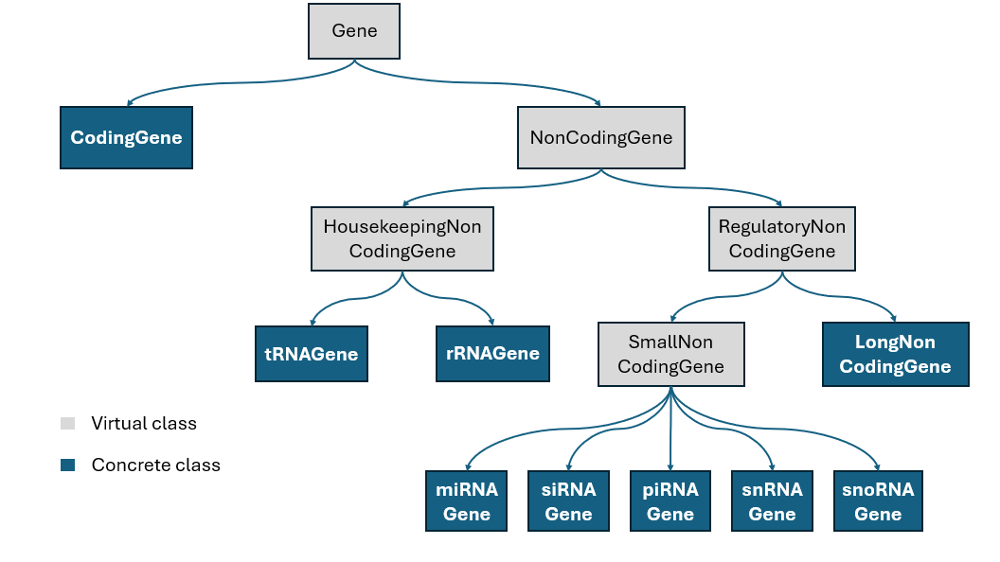
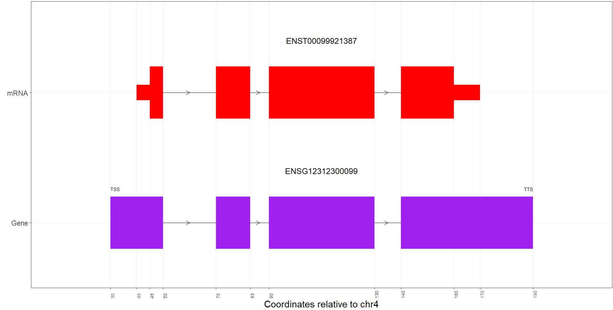

# Introduction

The **S4GeneR** package provides a comprehensive set of S4 classes 
and respective constructor functions for representing the classification of 
genes. The first class is the 'Gene' virtual class, from which the 'CodingGene' 
and 'NonCodingGene' classes are derived. The 'NonCodingGene' class is a virtual 
class from which 'HousekeepingNonCodingGene' and 'RegulatoryNonCodingGene' 
virtual classes are derived. From 'HousekeepingNonCodingGene' class, 'tRNAGene' 
and 'rRNAGene' classes are derived, while from 'RegulatoryNonCodingGene' class 
'SmallNonCodingGene' and 'LongNonCodingGene' classes are derived. 
From the virtual class 'SmallNonCodingGene', 'miRNAGene', 'siRNAGene', 
'piRNAGene', 'snRNAGene' and 'snoRNAGene' classes are derived.

The package also provides methods to access and modify all attributes of these 
objects.

# Classes description

Now the individual classes are presented one by one, with their attributes and 
constraints on them.

## Gene

The Gene class is the virtual class from which all the others, directly or 
indirectly, are derived. The attributes of this class, which are inherited by 
all the others classes, are:

-   **gene_ensembl_id**: gene ENSEMBL ID, e.g. ENSG00000000123. A dedicated 
function will automatically check that the provided ID is a valid 
gene ENSEMBL ID.

-   **hugo_symbol**: gene Hugo symbol, e.g. TP53.

-   **gene_complete_name**: gene complete name, e.g. Tumor Protein 53.

-   **gene_coordinates**: gene genomic coordinates (as GRanges object).

-   **gene_sequence**: gene complete sequence (as DNAString object). If gene 
coordinates are defined, the gene sequence must be long exactly 
(gene_end - gene_start).

-   **exons_coordinates**: gene's exons coordinates (as GRanges object). The 
provided ranges can't overlap because, by definition, exons are the base pairs 
covered by at least one transcript of the gene, so if 2 exons overlap they 
represent 1 exon (which is their sum). If gene coordinates are defined, the 
first exon's start must correspond to the gene's start and the last exon's end 
must correspond to the gene's end, because a gene always starts and ends with
an exon. If gene sequence is defined, but gene coordinates are not, then the 
span of the exons coordinates must be compatible with the gene sequence length.

-   **alternative_transcripts**: dataframe with 2 columns: 
'transcript_ensembl_id' and 'protein_coding' (TRUE/FALSE/NA), to store basic 
informations regarding alternative transcripts of the gene. The NonCodingGene 
class (and derived classes) has an additional constraint: the protein_coding 
column can't never contain TRUE (because of the definition of non-coding).
A dedicated function will automatically check that each provided ID is a 
valid transcript ENSEMBL ID.

All the coordinates relative to a gene object (gene coordinates, exons 
coordinates, mRNA and CDS coordinates in coding genes, pre-ncRNA coordinates 
in non-coding genes) must share both the same chromosome and strand.
The chromosome must be a valid human chromosome (or mitochondrial) and the 
strand can be '*', '+' or '-'.

## CodingGene

The CodingGene class directly derives from the Gene class and, as the name 
suggests, represents protein-coding genes. The additional attributes provided 
by this class are:

-   **mRNA_ensembl_id**: mRNA ENSEMBL ID, e.g. ENST00000000123. A dedicated 
function will automatically check that the provided ID is a valid transcript 
ENSEMBL ID.

-   **mRNA_coordinates**: mRNA coordinates (as GRanges object). If gene 
coordinates are defined, mRNA coordinates start and end must be inside the 
gene coordinates. If exons coordinates are defined, mRNA coordinates start and 
end must fall on the exons.

-   **cds_coordinates**: CDS coordinates (as GRanges object). If gene 
coordinates are defined, CDS coordinates start and end must be inside the 
gene coordinates. If mRNA coordinates are defined, CDS coordinates start and 
end must be inside the mRNA coordinates. If exons coordinates are defined, CDS 
coordinates start and end must fall on the exons.

-   **protein_ensembl_id**: protein ENSEMBL ID, e.g. ENSP00000000123. A 
dedicated function will automatically check that the provided ID is a valid 
protein ENSEMBL ID.

-   **protein_sequence**: protein complete sequence (as AAString object). If 
gene coordinates are defined, (gene_end - gene_start) must be greater than 
(protein_length*3 + 3), because 3 nucleotides are required for each aminoacid 
and 3 additional nucleotides are required for the stop codon. The same holds 
for the cases in which gene sequence and mRNA coordinates are defined.
If exons coordinates are defined, then it's computed the intersection between 
them and each other defined coordinates. This is then taken into account in 
order to check the validity of the protein sequence length, considering that 
only exons can contribute to the final protein.
Finally, if CDS coordinates are defined, along with exons coordinates, the 
protein length can't be greater than the sum of widths of the ranges resulting 
from the intersection between CDS and exons coordinates, divided by 3 (in this 
case the 3 nucleotides accounting for the stop codon are not considered 
because the stop codon is outside the CDS).

-   **protein_description**: protein description.

## NonCodingGene

The NonCodingGene class directly derives from the Gene class and, as the name 
suggests, represents non-coding genes. The additional attributes provided by 
this class, which are inherited by all the derived classes, are:

- **pre_ncRNA_ensembl_id**: pre-ncRNA ENSEMBL ID, e.g. ENST00000099123. A 
dedicated function will automatically check that the provided ID is a valid
transcript ENSEMBL ID.

- **pre_ncRNA_coordinates**: pre-ncRNA coordinates (as GRanges object). If gene
coordinates are defined, pre-ncRNA coordinates start and end must be inside 
the gene coordinates. If exons coordinates are defined, pre-ncRNA coordinates 
start and end must fall on the exons. If gene sequence is defined, while gene 
and exons coordinates aren't, its length can't be shorter than 
(pre-ncRNA_end - pre-ncRNA_start).

## HousekeepingNonCodingGene

The HousekeepingNonCodingGene class directly derives from the NonCodingGene 
class and, as the name suggests, represents housekeeping non-coding genes. The 
additional attributes provided by this class, which are inherited by all the 
derived classes, are:

- **essentiality_score**: gene essentiality score, which can be assigned with 
different techniques.

- **ubiquitous_expression**: logical to indicate if the gene is ubiquitously 
expressed or not.

## tRNAGene

The tRNAGene class directly derives from the HousekeepingNonCodingGene class 
and, as the name suggests, represents genes encoding for transfer RNAs. The 
additional attributes provided by this class are:

- **tRNA_mature_sequence**: mature tRNA sequence (as RNAString object).
Depending on which coordinates are defined, the validity of the length of the 
mature tRNA sequence is checked. The same applies in the case in which no 
coordinates are defined, but gene sequence is.

- **anticodon**: tRNA's anticodon sequence (as RNAString object). It must be 
of length 3 (if defined) and if mature tRNA sequence is defined, then the 
inserted anticodon must be present in it. Finally, it's computed the respective
codon by computing its reverse complement (considering both anticodon and codon
read from 5' to 3', then the codon is the reverse complement of the anticodon); 
the codon can't be one of the three stop codons because, by definition, no 
tRNAs match stop codons.

- **amino_acid**: anticodon's correspondent aminoacid (as AAString object). If 
anticodon is defined, it's computed the respective codon and its translation 
must correspond to the inserted aminoacid.

## rRNAGene

The rRNAGene class directly derives from the HousekeepingNonCodingGene class 
and, as the name suggests, represents genes encoding for ribosomal RNAs. The 
additional attributes provided by this class are:

- **rRNA_mature_sequence**: mature rRNA sequence (as RNAString object).
Depending on which coordinates are defined, the validity of the length of the 
mature rRNA sequence is checked. The same applies in the case in which no 
coordinates are defined, but gene sequence is.

- **rRNA_type**: type of rRNA. Must be a valid human rRNA type (including 
mitochondrial), so it can be: 5S, 5.8S, 18S, 28S, 12S and 16S. If coordinates 
are defined, the chromosome must be biologically consistent w.r.t. the defined 
rRNA type: if rRNA type is either 12S or 16S, then chromosome must be 'chrM'; 
if rRNA type is 5S then chromosome must be 'chr1'; if rRNA type is 5.8S, 18S
or 28S then chromosome must be one of {chr13,chr14,chr15,chr21,chr22}.

## RegulatoryNonCodingGene

The RegulatoryNonCodingGene class directly derives from the NonCodingGene 
class and, as the name suggests, represents genes encoding for non-coding 
regulatory RNAs. The additional attributes provided by this class, which are 
inherited by all the derived classes, are:

- **regulatory_functions**: list with gene's regulatory functions.

- **targets_ensembl_id**: list with the ENSEMBL IDs of the gene's targets. A 
dedicated function will automatically check that the each provided ID is a 
valid gene/transcript/protein ENSEMBL ID.

## SmallNonCodingGene

The SmallNonCodingGene class directly derives from the RegulatoryNonCodingGene 
class and, as the name suggests, represents genes encoding for small non-coding 
RNAs. This class doesn't provide any additional attributes since its creation 
was only meant for the sake of clarity.
All the genes of this class (and derived classes) must produce RNAs which, in 
their mature version, are shorter than 200 nucleotides.

## miRNAGene

The miRNAGene class directly derives from the SmallNonCodingGene class and, as 
the name suggests, represents genes encoding for micro RNAs. The additional 
attributes provided by this class are:

- **miRNA_mature_sequence**: mature miRNA sequence (as RNAString object).
Depending on which coordinates are defined, the validity of the length of the 
mature miRNA sequence is checked. The same applies in the case in which no 
coordinates are defined, but gene sequence is.

- **seed_sequence**: miRNA seed sequence (as RNAString object). If the mature 
miRNA sequence is defined, the inserted seed sequence must be contained in it.

## siRNAGene

The siRNAGene class directly derives from the SmallNonCodingGene class and, as
the name suggests, represents genes encoding for short interfering RNAs. The 
additional attributes provided by this class are:

- **siRNA_mature_sequence**: mature siRNA sequence (as RNAString object).
Depending on which coordinates are defined, the validity of the length of the 
mature siRNA sequence is checked. The same applies in the case in which no 
coordinates are defined, but gene sequence is.

- **siRNA_off_targets**: list with siRNA gene's off-targets.

## piRNAGene

The piRNAGene class directly derives from the SmallNonCodingGene class and, as 
the name suggests, represents genes encoding for piwi-interacting RNAs. The 
additional attributes provided by this class are:

- **piRNA_mature_sequence**: mature piRNA sequence (as RNAString object).
Depending on which coordinates are defined, the validity of the length of the 
mature piRNA sequence is checked. The same applies in the case in which no 
coordinates are defined, but gene sequence is.

- **piRNA_associated_PIWI_proteins**: list with PIWI proteins associated to the 
piRNA gene.

## snRNAGene

The snRNAGene class directly derives from the SmallNonCodingGene class and, as 
the name suggests, represents genes encoding for small nuclear RNAs. The 
additional attributes provided by this class are:

- **snRNA_mature_sequence**: mature snRNA sequence (as RNAString object).
Depending on which coordinates are defined, the validity of the length of the 
mature snRNA sequence is checked. The same applies in the case in which no 
coordinates are defined, but gene sequence is.

- **spliceosome_complex**: spliceosome complex to which the snRNA gene is 
associated. This can be: U1, U2, U4, U5, U6 or 'not associated to spliceosome'.

## snoRNAGene

The snoRNAGene class directly derives from the SmallNonCodingGene class and,
as the name suggests, represents genes encoding for small nucleolar RNAs. The 
additional attributes provided by this class are:

- **snoRNA_mature_sequence**: mature snoRNA sequence (as RNAString object).
Depending on which coordinates are defined, the validity of the length of the 
mature snoRNA sequence is checked. The same applies in the case in which no 
coordinates are defined, but gene sequence is.

- **snoRNA_box_type**: snoRNA gene's box type. This can be either 'C/D' or 
'H/ACA'.

## LongNonCodingGene

The LongNonCodingGene class directly derives from the RegulatoryNonCodingGene 
class and, as the name suggests, represents genes encoding for long non-coding 
RNAs. The additional attributes provided by this class are:

- **lncRNA_mature_sequence**: mature lncRNA sequence (as RNAString object).
Depending on which coordinates are defined, the validity of the length of the 
mature lncRNA sequence is checked. The same applies in the case in which no 
coordinates are defined, but gene sequence is.
Considering the fact that is a long non-coding RNA, the mature sequence must 
be longer than 200 nucleotides, and the same applies to the gene sequence and 
all coordinates (e.g. it's obvious that a gene shorter than 200 nucleotides 
is not able to produce a mature lncRNA longer than 200 nucleotides).

- **lncRNA_location_class**: lncRNA gene's genomic location class. This can be 
intergenic, bidirectional, antisense or sense.

- **lncRNA_functional_class**: lncRNA gene's functional class. This can be 
decoy, guide or dynamic scaffold.

# Creation and manipulation of gene objects

Since Gene, NonCodingGene, HousekeepingNonCodingGene, RegulatoryNonCodingGene 
and SmallNonCodingGene are virtual classes, it's not possible to create objects 
directly from these classes.\
Instead, it's possible to create objects from CodingGene, tRNAGene, rRNAGene, 
miRNAGene, siRNAGene, piRNAGene, snRNAGene, snoRNAGene and LongNonCodingGene 
classes, by using either the new() function or the dedicated constructor 
functions, which have the same name as the corresponding class.
See the package vignette for the actual code.

# Additional provided functions

## lengthProduct

The lengthProduct function allows to compute the length of the gene product, 
automatically evaluating the gene type.
If the gene is a protein-coding gene (meaning of class CodingGene), the length 
of the encoded protein (if defined) is returned.
Instead, if the gene is a non-coding gene (meaning of class NonCodingGene or 
derived classes), the length of the mature transcript (if defined) is returned.

## plot
This package also provides an extension of the generic function 'plot'.
Depending on the class of the object passed to the function, and depending on
the available informations, a plot of the gene will be generated.
Exons coordinates are necessary in order to produce even the most basic plot.
This package doesn't consider cassette exons or alternative splicing sites,
so all the exons between, for example, start and end of the mRNA, will be
entirely included in the graphic representation.
If the strand is *, then it will be assumed to be - in the plot.

